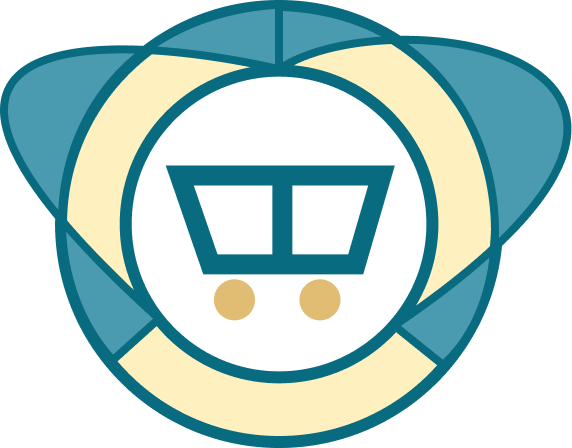

# Gerai UMKM




Gerai UMKM adalah sebuah platform yang menjembatani pelaku UMKM dan mahasiswa. Website ini bertujuan untuk memberikan peluang bagi mahasiswa untuk mengembangkan kemampuan mereka dengan berkontribusi pada proyek yang disediakan oleh UMKM. Platform ini menyediakan fitur untuk 3 jenis pengguna: **Superadmin (Pemilik), Admin (UMKM), dan Mahasiswa**.

---

## Fitur Utama

### **1. Superadmin (Pemilik)**
Superadmin memiliki akses penuh untuk mengelola seluruh aktivitas di platform melalui fitur-fitur berikut:
- **Dashboard**: Menampilkan data statistik jumlah UMKM dan mahasiswa yang terdaftar, termasuk status verifikasi dan keterlibatan mereka.
- **Mahasiswa**: Mengelola dan memperbarui data mahasiswa yang terdaftar, termasuk riwayat akademik dan status keterlibatan.
- **Artikel**: Membuat, mengedit, melihat, dan menghapus artikel di platform.
- **UMKM**: Memantau dan mengelola akun UMKM, termasuk verifikasi, pembaruan profil, dan aktivitas mereka.
- **Project UMKM**: Menambahkan proyek baru, memantau status proyek, dan mengelola rincian proyek UMKM.
- **Chat**: Berkomunikasi secara real-time dengan mahasiswa dan admin melalui fitur obrolan.
- **Konsultasi Bisnis**: Memberikan tanggapan dan feedback untuk konsultasi bisnis dari UMKM.
- **Verifikasi UMKM**: Memverifikasi data UMKM yang mendaftar untuk memastikan validitas dan kualitas layanan.
- **Kelola Sertifikat Mahasiswa**: Mengirimkan sertifikat melalui email kepada mahasiswa yang telah menyelesaikan proyek.
- **Ganti Password**: Mengelola keamanan akun Superadmin.

### **2. Admin (UMKM)**
Admin dapat mengelola informasi dan proyek UMKM melalui fitur berikut:
- **Dashboard**: Informasi profil UMKM, termasuk foto profil dan deskripsi bisnis.
- **Artikel**: Membuat, mengedit, menghapus, dan mengelola artikel yang akan dipublikasikan.
- **Lamaran**: Mengelola lamaran mahasiswa yang masuk untuk proyek UMKM.
- **Chat**: Berkomunikasi dengan mahasiswa dan Superadmin secara real-time.
- **Chatbot**: Layanan interaktif otomatis untuk menjawab pertanyaan terkait bisnis UMKM.
- **Project**: Menambahkan, mengedit, dan mengelola proyek UMKM yang terdaftar di platform.
- **Konsultasi**: Mengajukan permohonan konsultasi untuk mendapatkan panduan dari Superadmin.

### **3. User (Mahasiswa)**
Mahasiswa dapat memanfaatkan fitur berikut:
- **Dashboard**: Pusat informasi dengan akses ke fitur utama seperti Project, UMKM, Artikel, dan Profil.
- **UMKM**: Menjelajahi daftar UMKM dengan informasi profil dan kategori bisnis.
- **Project**: Melihat dan melamar proyek yang tersedia berdasarkan kategori minat.
- **Artikel**: Membaca artikel tentang UMKM, tips bisnis, dan pengembangan karier.
- **Profile**: Mengelola informasi pribadi, melacak proyek, dan memperbarui profil.
- **Chat**: Berkomunikasi secara langsung dengan admin dan Superadmin.
- **ChatBot**: Mendapatkan panduan otomatis menggunakan API ChatGPT.

---

## Autentikasi Akun
Gunakan akun berikut untuk mengakses berbagai role di platform:

### Superadmin
- **Email**: `unitrade@gmail.com`
- **Password**: `uni123`

### Admin (UMKM)
- **Email**: `mybengkel@gmail.com`
- **Password**: `bengkel123`

### User (Mahasiswa)
- **Email**: `kadavi0934@gmail.com`
- **Password**: `dapi123`

---

## Struktur Proyek
- **Frontend**: Menggunakan framework **Next.js** dengan styling **Tailwind CSS**.
- **Backend**: Dibangun dengan **Laravel** menggunakan database MySQL.
- **Chat**: Implementasi real-time chat menggunakan **Laravel WebSocket** (Pusher) dan **Chatify**.
- **API Chatbot**: Mengintegrasikan API **ChatGPT** untuk fitur chatbot.

---

## Cara Instalasi dan Penggunaan
### 1. Clone Repository
```bash
git clone https://github.com/your-repository/gerai-umkm.git
